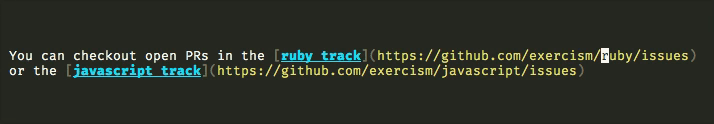

# emacs-git-io

Interactive command to replace github URL at point with a shortened one using [git.io](https://git.io/).

Gets the URL at current cursor position, makes a request to [git.io](https://git.io/)
to get the shortened URL and replaces the original url with the shortened one.

Note: This package uses [git.io](https://git.io/) which works only for github URLs.

See it in action:

#### TODO:

* Handle the invalid url error better - give proper message.
* For some strange reason [git.io](https://git.io/) does not work with `http://` urls
  check for `http://` urls and convert them to `https://` before making request.
* Write some tests.
